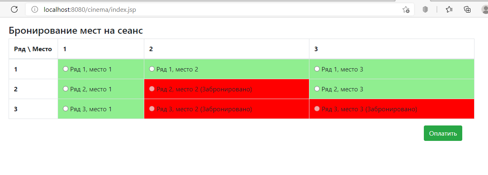
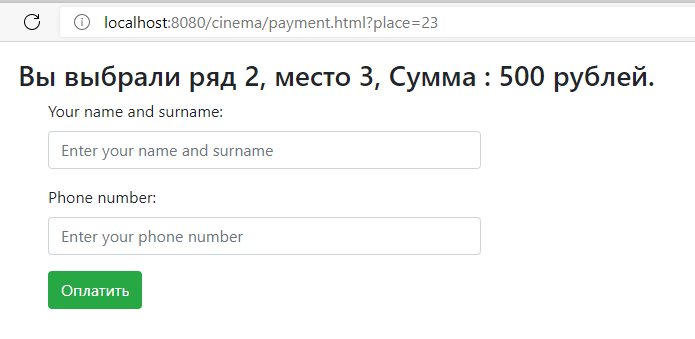
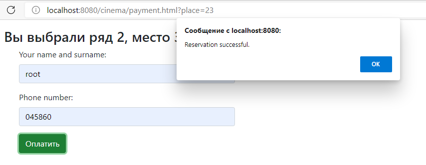

# job4j_cinema
### Description of the project.
This project has developed a simple website for buying cinema tickets. The main page shows a list of seats in the hall to choose from. The data is loaded via Ajax. The occupied seats are displayed in the table. The page is periodically updated via timeout. After the user has selected a seat, he is redirected to the payment page, where he writes down his data and phone number for buying a ticket. The purchased place can no longer be sold again and is highlighted in red. The project created tests using junit and mockito

### Used technologies
- Java EE 8
- MVC as design pattern.
- Servlet
- Slf4j for logging.
- Liquibase
- JDBC
- PostgresSQL
- Front(jsp/jstl/js/HTML/bootstrap/CSS/ajax)
- Jackson for JSON building.
- Tomcat Web server
- Maven as a build system
- Mockito  
- CI/CD Travis
- Checkstyle
- Jacoco

### Steps of work
After you pushed webapp, you can use it. Steps of work are next:

1. The main page with all places
   

2. Payment page for the selected place
   
   

3. Successful ticket purchase
   